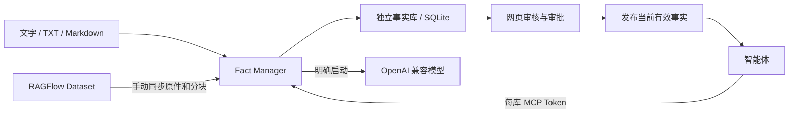

# Fact Manager

独立的事实管理系统：将来源材料中的信息提取为候选事实，经人工核验、审批与发布后，供智能体通过 MCP 读取。
每条事实记录主体、属性、值、单位、适用条件、有效期及原文证据。RAGFlow 是可选的来源连接器；本地文字、TXT 和 Markdown 可以独立使用。

## 功能

- 多事实库，各自拥有来源、提取指令、SQLite 数据库和审核记录。
- 保存不可变原件与分块快照，验证 SHA256；支持核对 Word 表格、PPTX 页面布局和 PDF 原生文本。
- OpenAI 兼容模型提取、语义检查；付费任务均由用户明确启动。
- 网页审核、批量操作与 XLSX 导入导出；审批和发布分开。
- 关联已审批前提提出检查意见或推导候选；前提过期或变更时，依赖结论停止提供。
- 每库可生成多个只读／检查 MCP Token，支持撤销与有效期；MCP 无权审批或发布。
- 共享管理员 Token 登录网页，CSRF 校验和长期续期的 HttpOnly Cookie。



## 安装与启动

需要 Python 3.11 或更新版本。代码和中文网页随 Python 包一起安装，无需前端构建。

```bash
git clone https://github.com/DictXiong/Fact-Manager.git
cd Fact-Manager
python3 -m venv .venv
. .venv/bin/activate
python -m pip install .
cp config.example.json config.json
mkdir -p secrets state
chmod 700 secrets state
python -c 'import secrets; from pathlib import Path; p = Path("secrets/admin-token"); p.write_text(secrets.token_urlsafe(32)); p.chmod(0o600)'
# 按部署地址修改 config.json，再启动。
fact-manager --config ./config.json serve
```

服务默认监听 `127.0.0.1:9382`。网页认证使用 Secure Cookie，**应通过 HTTPS 反向代理访问**。
`public_host` 填实际访问域名（带非默认端口时包含端口），不包含协议或路径。
模型与 RAGFlow 的 Key 可通过环境变量 `LLM_API_KEY`、`RAGFLOW_API_KEY` 提供，或在运行时环境文件中设置；不要提交到仓库。

最小 Nginx 代理片段（放入已有的 HTTPS `server` 中）：

```nginx
location / {
    proxy_pass http://127.0.0.1:9382;
    client_max_body_size 8m;
    proxy_buffering off;
    proxy_read_timeout 300s;
}
```

管理员 Token 从 `admin_token_file` 读取，或使用 `FACT_ADMIN_TOKEN` 环境变量，至少 16 个字符。
登录时在网页输入该 Token；它不能代替 MCP Token。修改管理员 Token 后重启服务使旧网页会话失效。

## 配置

参见 [config.example.json](config.example.json)。相对路径以进程工作目录为基准；生产环境建议使用绝对路径。

| 字段 | 用途 |
| --- | --- |
| `state_dir` | 持久化目录，包含目录数据库、各库数据库、原件、分块和审核归档 |
| `admin_token_file` | 运行时管理员 Token 文件 |
| `env_file` | 可选 `KEY=value` 环境文件，不执行 Shell 展开 |
| `host` / `port` | 后端监听地址和端口 |
| `public_host` | HTTPS 入口域名，用于认证、来源下载和 MCP 连接 |
| `ragflow_url` | 可选 RAGFlow API 地址 |
| `ragflow_public_url` | 可选 RAGFlow 网页入口 |
| `llm_url` / `llm_model` | OpenAI 兼容模型 API 的 Base URL 和模型 ID |

RAGFlow 需要时再配置 `RAGFLOW_API_KEY` 和 Dataset 绑定。模型提取或语义检查需要 `LLM_API_KEY`。
不使用这些功能时，可以手动录入来源与候选事实、审核并发布。没有自动同步或自动收费任务。

## 使用

1. 网页登录，创建事实库。
2. 添加文字／TXT／Markdown，或绑定 RAGFlow Dataset 并点击“同步来源”。
3. 明确启动提取，或从证据分块手动添加候选。
4. 检查主体、属性、值、条件与原文，确认或拒绝。模型意见只是辅助。
5. 显式发布已确认事实，必要时允许外部引用。
6. 在库的“MCP 访问”页面生成只读或检查 Token，连接智能体。

完整流程、CLI、核验与推导规则见 [使用指南](docs/usage.md)。

## 开发与测试

```bash
python -m pip install -e '.[test]'
python -m pytest -q
```

测试使用合成资料、临时数据库与模拟 HTTP，不连接生产知识库或付费模型。
GitHub Actions 验证 Python 3.11 和 3.13 的安装与测试。
应用代码在 `fact_manager/`，网页在 `fact_manager/static/`，测试在 `tests/`。

NixOS 部署配置单独维护于 [NixOS-Config](https://github.com/DictXiong/NixOS-Config)，通过固定 Git 提交与内容哈希获取本仓库代码。
应用仓库不包含该部署的 SOPS 密钥、原始公司材料、数据库或运行时状态。

## 数据与运维

备份整个 `state_dir`，包括原件、各库 SQLite、目录数据库与审核归档；数据库应采用 SQLite 在线 backup 或停服务备份。
原件丢失、哈希不匹配、来源更新或停用会阻止相应事实的继续提供。
服务重启不会自动续跑收费任务，已完成分块会保留，用户可手动重新启动。

管理员共享一个 Token，操作人字段用于审计，不是独立账户认证。原生文件解析不能识别所有图片、扫描件、Logo 与连线；需要人工或具备视觉能力的智能体核对原件。
历史 `migrate-legacy` 命令保留旧公司版的默认库名与提取版本，仅用于兼容旧数据库，不附带任何旧数据库或原件。
